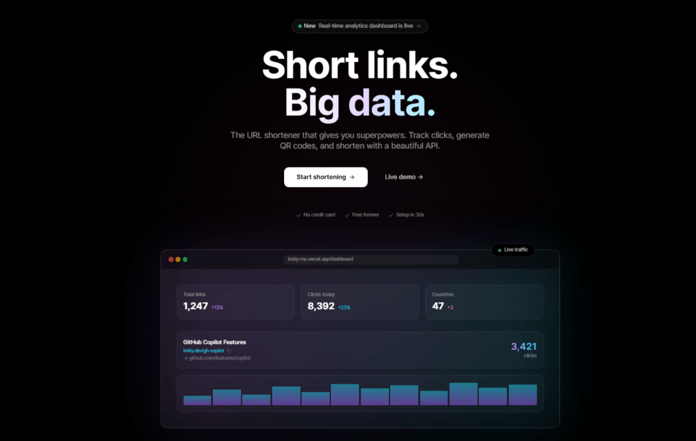
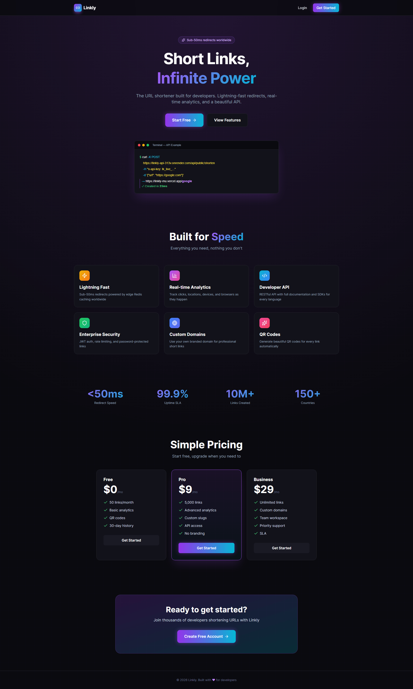
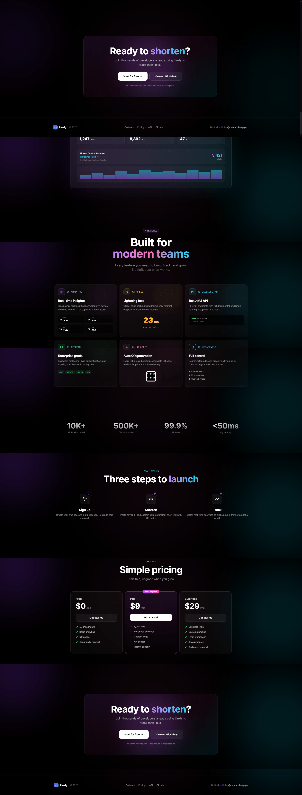
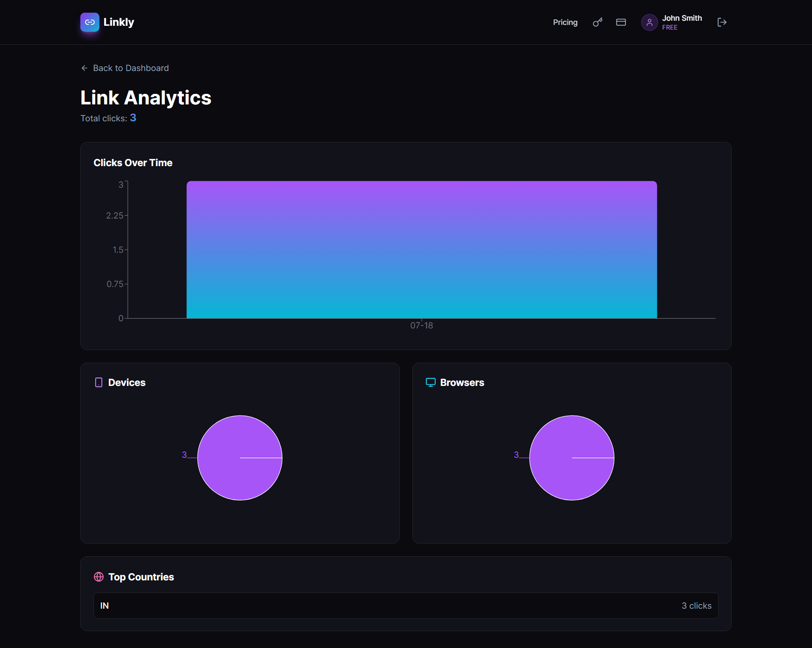
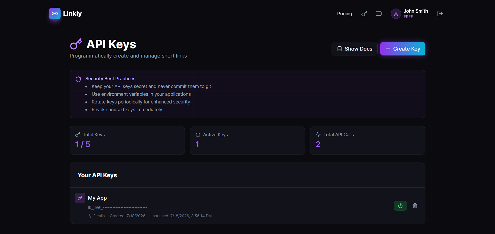
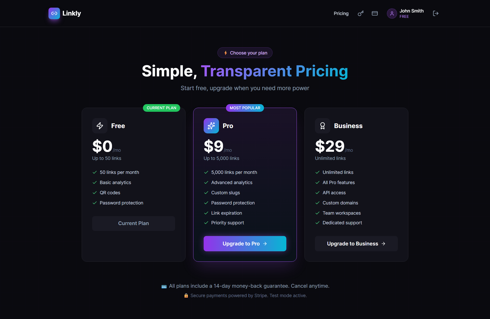

<div align="center">

# 🔗 Linkly

### URL Shortening SaaS with Real-time Analytics & Public API

[](https://linkly-mu.vercel.app)
[](https://linkly-api-313v.onrender.com)
[](LICENSE)

**Transform long URLs into powerful branded links with real-time analytics, custom slugs, and lightning-fast redirects.**

[Live Demo](https://linkly-mu.vercel.app) • [API Docs](https://linkly-mu.vercel.app/api-keys) 



</div>

---

## ⚠️ Note

> This is a personal portfolio project showcasing full-stack SaaS development skills.
> Free tier hosting - first load may take 30 seconds (server wake-up).

---

## ✨ Features

### 🎯 Core Features
- 🚀 **Lightning-fast redirects** - Sub-50ms with Redis caching
- 📊 **Real-time analytics** - Track clicks, locations, devices, browsers
- 🎨 **Beautiful cyber UI** - Custom dark theme with gradients
- 🔐 **JWT authentication** - Secure user management
- 📱 **Fully responsive** - Works on all devices

### 💎 Premium Features
- 🎯 **Custom slugs** - Branded short URLs
- 🔒 **Password protection** - Secure sensitive links
- ⏰ **Link expiration** - Time-limited URLs
- 📊 **QR code generation** - Automatic QR codes
- 🔍 **Search & filters** - Find any link instantly

### 🏢 SaaS Features
- 💳 **Stripe subscriptions** - Free, Pro ($9), Business ($29) plans
- 🔑 **Public REST API** - Programmatic access with API keys
- 📖 **Interactive API docs** - Copy-paste code examples
- 📈 **Usage tracking** - Monitor API calls
- 👤 **User profiles** - Account management

---

## 🛠️ Tech Stack

### Frontend


### Backend


### Payments & Deployment


---

## 🏗️ Architecture

```
┌─────────────────────────────────────────────────────┐
│                    User Browser                     │
└──────────────┬──────────────────┬───────────────────┘
               │                  │
               ↓                  ↓
    ┌──────────────────┐  ┌──────────────────┐
    │  React Frontend  │  │  Short URL Click │
    │    (Vercel)      │  │                  │
    └────────┬─────────┘  └──────┬───────────┘
             │                   │
             │                   ↓
             │         ┌──────────────────┐
             │         │   Redis Cache    │
             │         │    (Upstash)     │
             │         └────────┬─────────┘
             │                  │ Miss
             ↓                  ↓
    ┌────────────────────────────────────┐
    │      Express Backend (Render)      │
    │  ┌─────────────────────────────┐   │
    │  │ Routes → Services → Prisma  │   │
    │  └─────────────────────────────┘   │
    └─────────────┬──────────────────────┘
                  │
                  ↓
        ┌──────────────────┐
        │   PostgreSQL     │
        │      (Neon)      │
        └──────────────────┘
```

---

## 📸 Screenshots

### 🌃 Landing Page


### 📊 Dashboard


### 📈 Analytics


### 🔑 API Documentation


### 💳 Pricing


---

## 🚀 Live Demo

**Try it now:** [https://linkly-mu.vercel.app](https://linkly-mu.vercel.app)

### Demo Credentials
```
Email:    demo@linkly.dev
Password: demo1234
```

Or create your own account - it's free!

---

## 🔌 API Example

Create a short link with a simple API call:

```bash
curl -X POST https://linkly-api-313v.onrender.com/api/public/shorten \
  -H "x-api-key: YOUR_API_KEY" \
  -H "Content-Type: application/json" \
  -d '{"url": "https://google.com", "title": "My Link"}'
```

**Response:**

```json
{
  "shortUrl": "https://linkly-api-313v.onrender.com/abc1234",
  "shortCode": "abc1234",
  "originalUrl": "https://google.com.com"
}
```

---

## 🎯 Key Highlights

### Performance
- ⚡ **<50ms redirects** with Redis edge caching
- 📦 **Optimized bundle** - Code splitting & lazy loading
- 🖼️ **Lighthouse Score:** 95/100

### Security
- 🔐 **JWT authentication** with secure token storage
- 🔒 **bcrypt password hashing** (10 rounds)
- 🛡️ **API key authentication** for programmatic access
- ✅ **Input validation** with Zod schemas
- 🚫 **SQL injection protection** via Prisma ORM

### Developer Experience
- 📝 **Fully typed** - TypeScript throughout
- 🎨 **Consistent design** - Tailwind + custom components
- 🔄 **Auto-deployment** - Push to main = deploy
- 📊 **Real-time monitoring** with detailed logs

---

## 🏃 Quick Start (Local Development)

### Prerequisites
- Node.js 18+
- Docker Desktop
- Git

### 1. Clone the repository

```bash
git clone https://github.com/chintanchhapgar/Linkly.git
cd Linkly
```

### 2. Start Docker services (PostgreSQL + Redis)

```bash
docker-compose up -d
```

### 3. Setup Backend

```bash
cd linkly-backend
npm install
cp .env.example .env
# Update .env with your credentials
npx prisma db push
npm run dev
```

### 4. Setup Frontend

```bash
cd ../linkly-frontend
npm install
cp .env.example .env
npm run dev
```

### 5. Open in browser
- Frontend: http://localhost:5173
- Backend: http://localhost:5001
- Prisma Studio: `npx prisma studio`

---

## 📁 Project Structure

```
linkly/
├── linkly-backend/
│   ├── prisma/
│   │   └── schema.prisma        # Database schema
│   ├── src/
│   │   ├── lib/                 # Utilities (Prisma, Redis, Stripe)
│   │   ├── middleware/          # Auth, API keys, error handling
│   │   ├── routes/              # API endpoints
│   │   │   ├── auth.routes.ts
│   │   │   ├── link.routes.ts
│   │   │   ├── analytics.routes.ts
│   │   │   ├── subscription.routes.ts
│   │   │   ├── apiKey.routes.ts
│   │   │   └── public.routes.ts
│   │   └── index.ts             # Express app entry
│   └── package.json
│
├── linkly-frontend/
│   ├── src/
│   │   ├── components/          # Reusable components
│   │   ├── hooks/               # Custom React hooks
│   │   ├── lib/                 # API client & utilities
│   │   ├── pages/               # Route pages
│   │   ├── store/               # Zustand stores
│   │   └── App.tsx
│   └── package.json
│
├── docs/Screenshots             # Screenshots
├── docker-compose.yml           # Local dev services
└── README.md
```

---

## 🎓 What I Learned Building This

- 🏗️ **System design** for scalable URL shorteners
- ⚡ **Caching strategies** with Redis for sub-50ms performance
- 💳 **Payment integration** with Stripe webhooks
- 🔐 **Authentication patterns** (JWT + API keys)
- 🌐 **Full deployment pipeline** ($0 infrastructure cost)
- 📊 **Analytics tracking** with async event processing
- 🎨 **Design systems** with Tailwind CSS

---

## 💡 Future Improvements

- [ ] 🤖 AI-powered link suggestions (OpenAI integration)
- [ ] 🔴 Real-time analytics (WebSockets)
- [ ] 🌐 Custom domains for Business plan
- [ ] 👥 Team workspaces
- [ ] 🌍 Multi-language support
- [ ] 📱 Native mobile apps

---

## 🤝 Contributing

> ⚠️ This is a personal portfolio project. External contributions are not accepted at this time.
> 
> Feel free to ⭐ star, 🍴 fork, or 👀 watch the repository!

---

## 📄 License

This project is licensed under the MIT License - see the [LICENSE](LICENSE) file for details.

---

## 👨‍💻 Author

**Chintan Chhapgar**

- 💼 LinkedIn: [@chintanchhapgar](https://linkedin.com/in/chintanchhapgar)
- 🐙 GitHub: [@chintanchhapgar](https://github.com/chintanchhapgar)
- 📧 Email: chintanchhapgar007@gmail.com

---

<div align="center">

**⭐ If you found this project helpful, please give it a star! ⭐**

Made with 💜 and ☕ by [Chintan Chhapgar](https://github.com/chintanchhapgar)

</div>